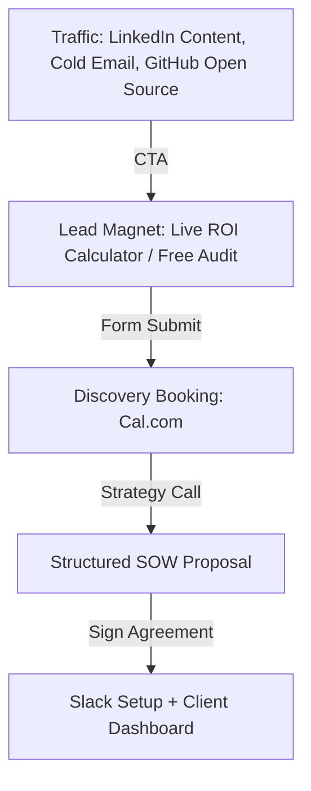

# AetherForge Collective — Agency Business & Marketing Strategy

This document outlines AetherForge Collective's premium branding strategy, pricing tiers, sales funnels, and cold outreach sequences.

---

## 1. Pricing Strategy

We implement a value-based pricing strategy rather than billing hourly. This aligns agency rewards with client business outcomes.

| Project Scope | Price Range | Ideal Client | Key Deliverables |
|---------------|-------------|--------------|------------------|
| **AI Agent MVP** | ₹20,000 - ₹55,000 | Early-stage Startup | Single-agent workflow, RAG integration, simple frontend widget, README. |
| **Growth SaaS / CRM** | ₹85,000 - ₹1,80,000 | Series A Startup | Full user auth, Prisma DB schemas, Stripe subscription hooks, multiple LangGraph agents. |
| **Enterprise Automation** | ₹1,80,000+ | Established Enterprise | Complex ETL pipelines, custom custom dashboards, n8n/Zapier automations, SLA support. |

---

## 2. Business Plan: AetherForge Collective

### Value Proposition
We build production-grade, stateful AI systems and full-stack software that scales, delivering measurable metrics (e.g. 70% support deflection, 90%+ query accuracy) in weeks, not months.

### Founders
- **Gadiparthi Poojith:** Core AI Agent Orchestrator & Full Stack Engineer.
- **Surya Antarvedi:** Data Science & Analytics Engineer.

### Revenue Projections (12 Months)
- Target: $150,000
- Average Project Size: $6,500
- Required Client Closings: 24 (2 per month)

---

## 3. Marketing Plan & Sales Funnel



### Lead Magnet Ideas
1. **The Live AI Cost Estimator:** (Present on our dashboard) where clients slider-configure their needs to see timelines and savings.
2. **Free 15-Minute RAG Audit:** Reviewing a client's PDF structure and advising on optimal chunking strategies.

---

## 4. Cold Outreach Templates

### Cold Email Template (B2B Lead Generation)

**Subject:** Solving support ticket load at [Company Name] using LangGraph

```text
Hi [Client First Name],

I noticed [Company Name] is scaling quickly, which usually means your customer support volume is ramping up fast as well.

Many teams default to generic support bots that hallucinate and can't check database states. We build stateful customer service agents using LangGraph that safely hook into your CRM to update records and resolve 73% of common questions without human intervention.

We designed a live interactive agent playground. You can test it out here: https://aetherforge.dev/dashboard

If you'd be interested, I can map out a draft architecture diagram showing how this would plug into your database. Do you have 10 minutes next week?

Best regards,
Gadiparthi Poojith
Co-Founder, AetherForge Collective
poojith@aetherforge.dev
```

### Cold DM Script (LinkedIn)

```text
Hi [First Name], saw your recent update about scaling the support team at [Company Name]. We build autonomous AI agents using LangGraph that integrate directly into custom databases to automate common support queries. We built a live test playground here: https://aetherforge.dev/dashboard. Open to a quick chat next week to see if we can help deflect some support volume?
```

---

## 5. Agency Newsletter Plan

- **Frequency:** Bi-weekly.
- **Content Mix:**
  - 40% Actionable AI tutorials (e.g. "How to chunk legal documents for pgvector").
  - 45% Client case study metrics (e.g. "How an invoice automation workflow saved our client 20 hrs/week").
  - 15% Agency news & new demo releases.
- **Goal:** Nurturing unqualified leads in our database list.
