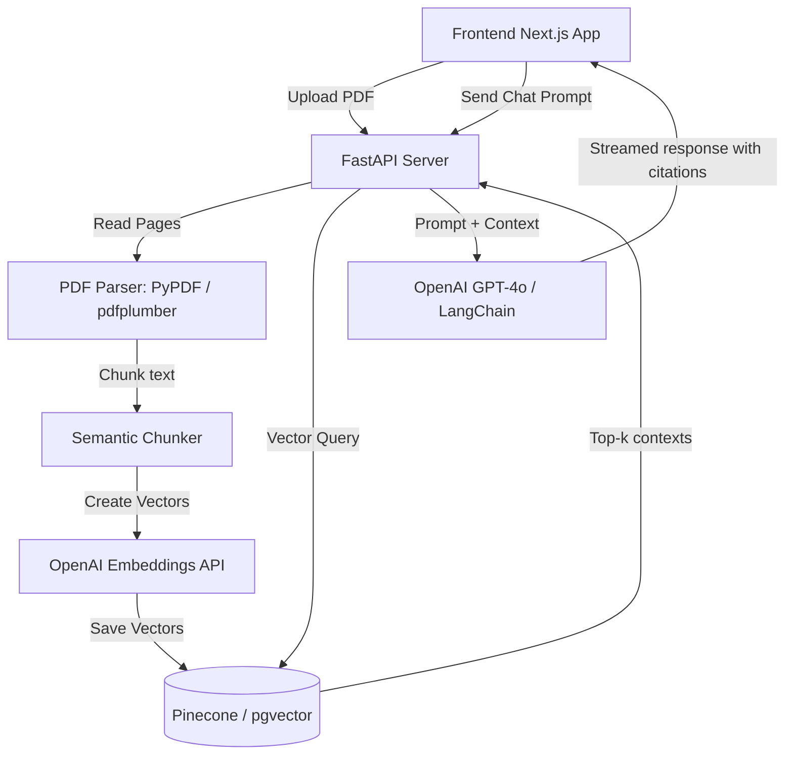

# AI PDF Chatbot — Architecture & Setup

This is a multi-document RAG (Retrieval-Augmented Generation) application allowing users to upload PDF documents, index them into a Vector Database, and chat with them using semantic search and contextual grounding.

## System Architecture



## Database Schema (Prisma / SQL)

```prisma
model Document {
  id        String   @id @default(uuid())
  userId    String
  fileName  String
  fileSize  Int
  storageUrl String  // S3 or Supabase Storage link
  chunks    Chunk[]
  createdAt DateTime @default(now())
}

model Chunk {
  id         String   @id @default(uuid())
  documentId String
  document   Document @relation(fields: [documentId], references: [id])
  content    String   // The text chunk content
  vectorId   String   // The vector ID in Pinecone/pgvector
  pageNumber Int
}
```

## Setup Instructions

### 1. Vector Database Setup
Create an account on Pinecone or enable pgvector on Supabase, and get an API key.

### 2. Backend API Setup (Python)
```bash
pip install fastapi uvicorn openai langchain pinecone-client pypdf
uvicorn main:app --reload --port 8002
```

### 3. Frontend App Setup
```bash
npm install @ai-sdk/openai ai
npm run dev
```
