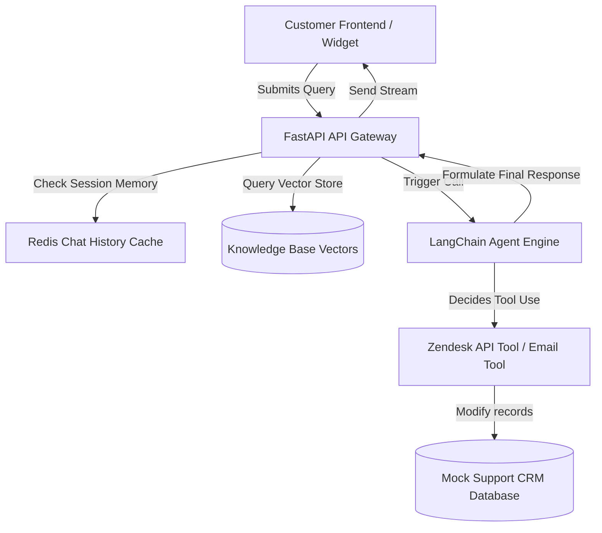

# AI Customer Support Agent — Architecture & Setup

This is a production-ready AI customer support agent that utilizes a knowledge database (RAG) to answer support queries and leverages function calling to automatically create, retrieve, and update support tickets in a mock Zendesk CRM backend.

## System Architecture



## Database Schema (Prisma)

```prisma
model Ticket {
  id          String   @id @default(uuid())
  customerEmail String
  subject     String
  status      String   @default("OPEN") // OPEN, PENDING, RESOLVED
  priority    String   @default("MEDIUM") // LOW, MEDIUM, HIGH
  messages    Message[]
  createdAt   DateTime @default(now())
  updatedAt   DateTime @updatedAt
}

model Message {
  id        String   @id @default(uuid())
  ticketId  String
  ticket    Ticket   @relation(fields: [ticketId], references: [id])
  sender    String   // 'customer' or 'agent'
  content   String
  createdAt DateTime @default(now())
}
```

## Setup Instructions

### 1. Backend Server (FastAPI)
```bash
pip install fastapi uvicorn openai langchain pydantic
uvicorn main:app --reload --port 8003
```

### 2. Frontend Chat Widget
```bash
npm install lucide-react
npm run dev
```
