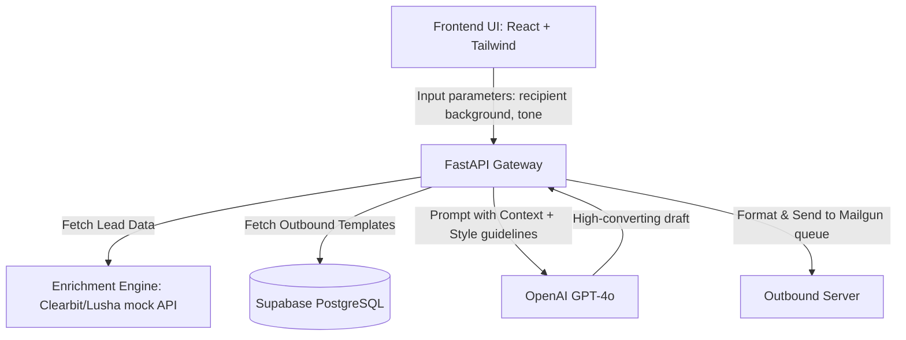

# AI Email Generator — Architecture & Setup

This is a premium AI-powered outbound sales and marketing email generator. It reads lead profiles, matches them with corporate value propositions, adjusts tone and length, and generates high-converting email drafts.

## System Architecture



## Setup Instructions

### 1. Backend Server (FastAPI)
```bash
pip install fastapi uvicorn openai pydantic
uvicorn main:app --reload --port 8004
```

### 2. Frontend Interface (Next.js)
```bash
npm run dev
```
