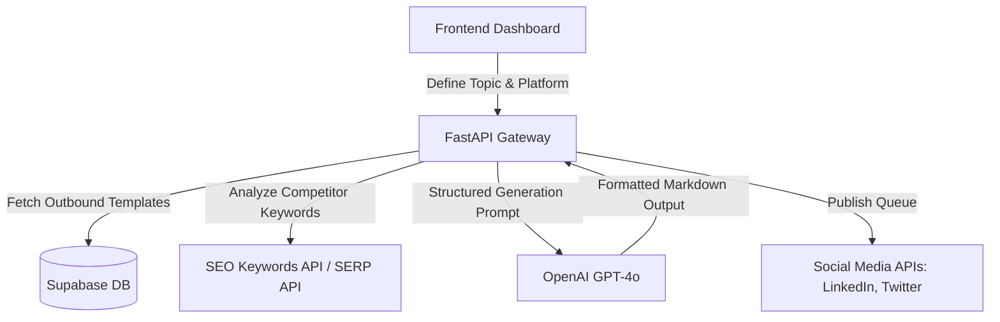

# AI Content Generator — Architecture & Setup

This is a multi-format AI content generation engine designed to create SEO blog posts, LinkedIn updates, and Twitter threads based on simple input keywords, using structured output formatting.

## System Architecture



## Setup Instructions

### 1. Backend Service (FastAPI)
```bash
pip install fastapi uvicorn openai pydantic
uvicorn main:app --reload --port 8005
```

### 2. Frontend Interface (Next.js)
```bash
npm run dev
```
