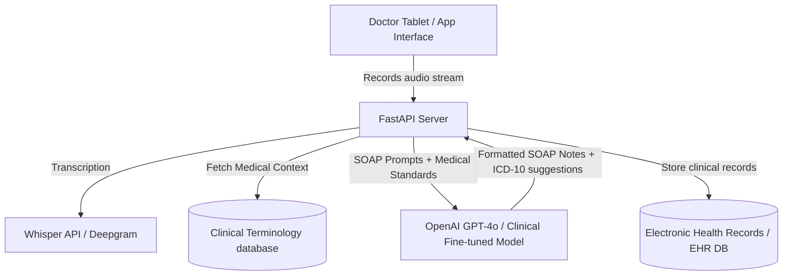

# AI Medical Assistant — Architecture & Setup

This is a clinical helper system that transcribes doctor-patient dialogues, analyzes symptoms, maps diagnoses to ICD-10 medical coding formats, and drafts clinical SOAP notes.

> [!WARNING]
> This system is designed for developer demonstrations and educational research. It must not be used for direct clinical diagnosis without certified medical oversight.

## System Architecture



## Setup Instructions

### 1. Backend Server (FastAPI)
```bash
pip install fastapi uvicorn openai pydantic
uvicorn main:app --reload --port 8006
```

### 2. Frontend SOAP Dashboard (Next.js)
```bash
npm run dev
```
