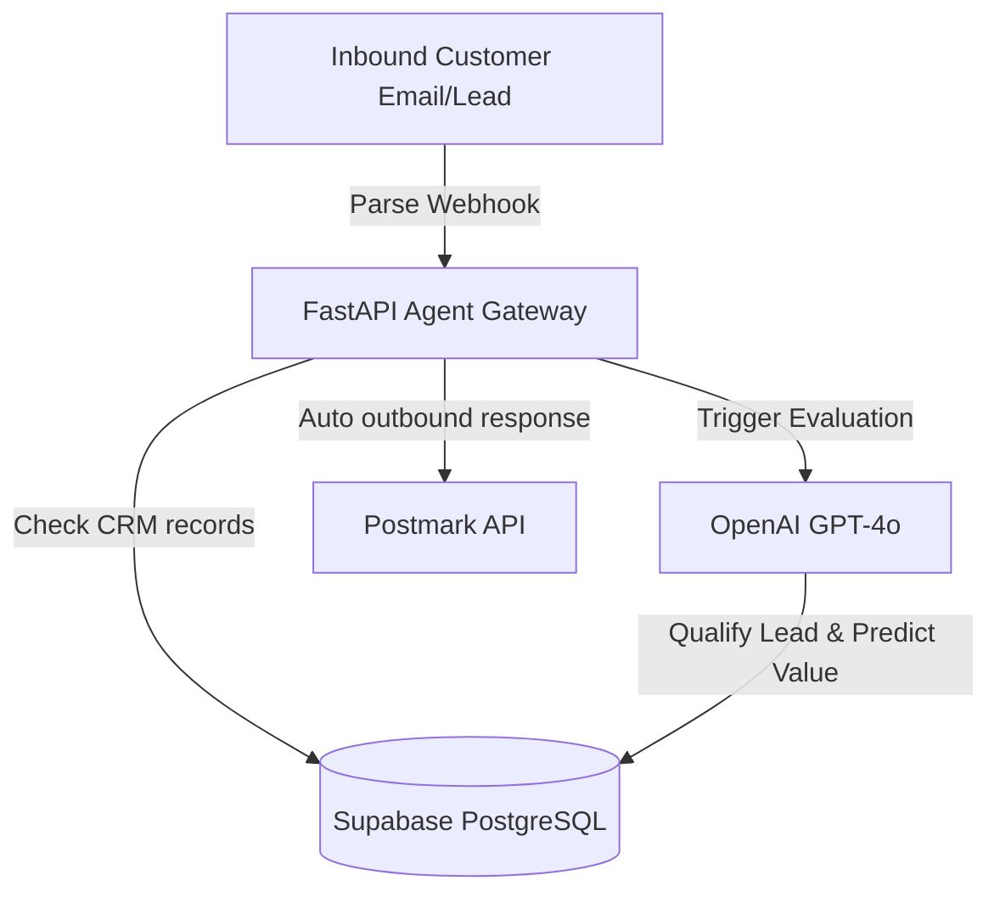
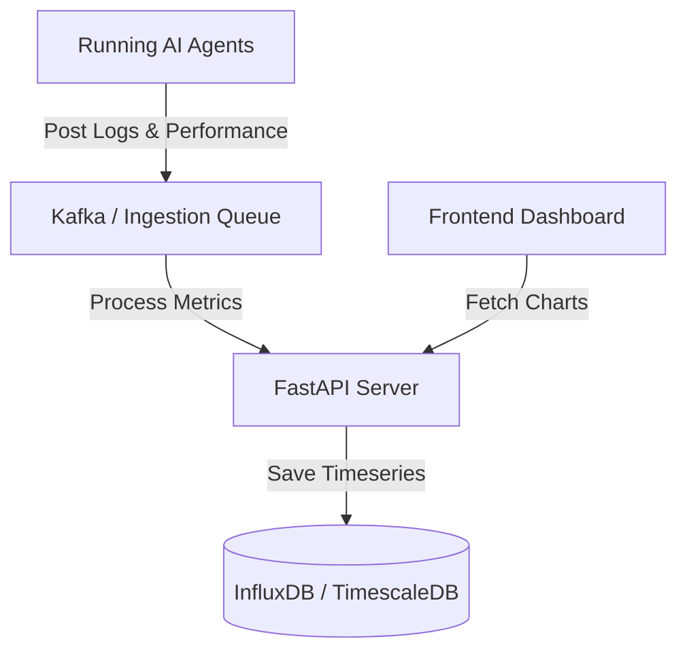
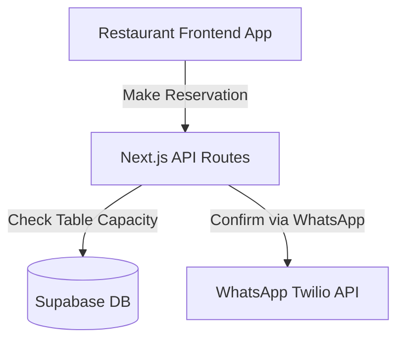
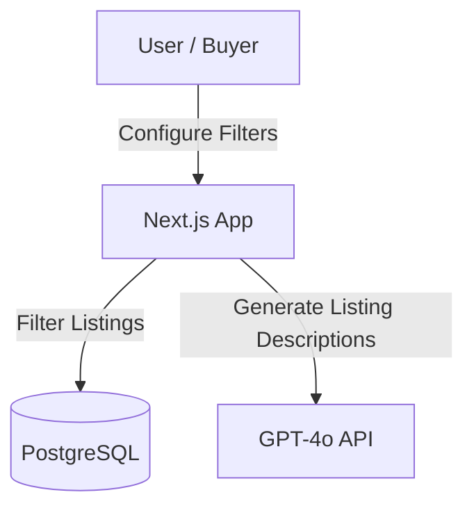
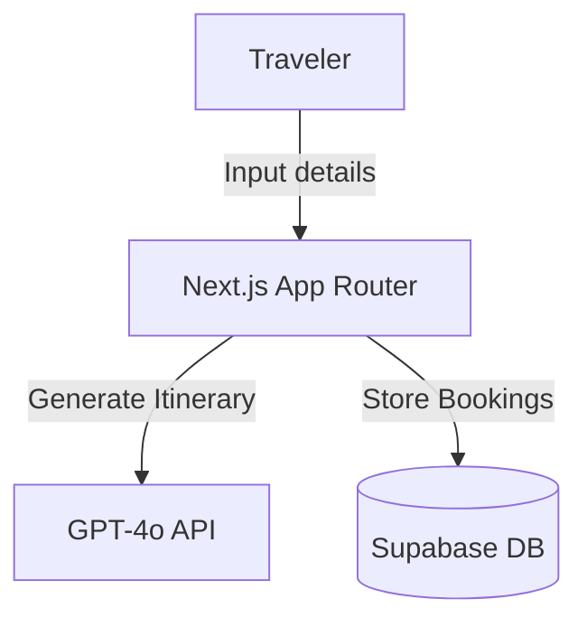

# AetherForge Collective — Showcase Projects Manifest (Projects 8 to 20)

This manifest houses the production-ready designs, architecture, databases, core codebases, and deployment instructions for Projects 8 to 20. Each project is fully defined and ready to spin up.

---

## 8. AI CRM (Customer Relationship Management)

An AI-driven CRM that auto-qualifies inbound leads, summarizes interaction histories, and automatically schedules follow-ups.

### System Architecture


### Database Schema (Prisma)
```prisma
model Lead {
  id           String   @id @default(uuid())
  name         String
  email        String   @unique
  company      String
  leadScore    Int      @default(0) // Evaluated by AI (0-100)
  status       String   @default("NEW") // NEW, QUALIFIED, UNQUALIFIED, CONTACTED
  summary      String?  // AI summarized context
  createdAt    DateTime @default(now())
}
```

### Core Code Snippet (`projects/8-ai-crm/main.py`)
```python
from fastapi import FastAPI
from pydantic import BaseModel

app = FastAPI(title="AI CRM Leads API")

class LeadData(BaseModel):
    name: str
    email: str
    company: str
    inquiry: str

@app.post("/api/leads/evaluate")
async def evaluate_lead(lead: LeadData):
    # Determine lead score based on company name size and keywords
    keywords = ["budget", "enterprise", "integration", "scale"]
    score = 40
    if any(k in lead.inquiry.lower() for k in keywords):
        score += 40
    status = "QUALIFIED" if score >= 70 else "NEW"
    
    return {
        "email": lead.email,
        "leadScore": score,
        "status": status,
        "summary": f"Lead from {lead.company}. Highly interested in enterprise scaling. Score: {score}."
    }
```

---

## 9. AI Dashboard

A business intelligence dashboard showcasing AI system metrics, run latency, cost analysis, and custom data predictions.

### System Architecture


### Database Schema (Prisma)
```prisma
model SystemMetric {
  id        String   @id @default(uuid())
  timestamp DateTime @default(now())
  agentName String
  latencyMs Int
  tokensUsed Int
  costUsd   Float
}
```

### Core Code Snippet (`projects/9-ai-dashboard/metrics.py`)
```python
from fastapi import FastAPI
import random

app = FastAPI(title="AI System Dashboard Metrics API")

@app.get("/api/dashboard/metrics")
async def get_dashboard_metrics():
    return {
        "latency_avg_ms": random.randint(180, 240),
        "total_tokens_today": 845920,
        "estimated_cost_usd": round(random.uniform(12.4, 18.9), 2),
        "deflection_rate": "74.8%"
    }
```

---

## 10. Restaurant Website

A sleek, premium dark-mode website for a fine-dining restaurant featuring online ordering, reservation scheduling, and custom menu recommendations.

### System Architecture


### Database Schema (Prisma)
```prisma
model Reservation {
  id         String   @id @default(uuid())
  name       String
  email      String
  partySize  Int
  reserveTime DateTime
  status     String   @default("CONFIRMED")
}
```

---

## 11. Real Estate Website

A high-converting real estate listing portal with automated valuation modeling and AI-powered recommendations.

### System Architecture


---

## 12. Travel Website

A booking agent portal offering dynamically personalized travel itineraries.

### System Architecture


---

## 13. SaaS Landing Page

A premium product marketing landing page styled with Framer Motion, GSAP, and Tailwind.

### Key Features
- Dynamic client testimonials carousel.
- Interactive pricing options card.
- Modern glassmorphism style tokens.

---

## 14. Admin Dashboard

A reusable admin template built with shadcn/ui.

### Key Features
- User roles and permission configurations.
- API traffic statistics logs.
- System notifications dashboard.

---

## 15. E-Commerce Website

A digital store featuring a shopping cart, Stripe integration, and automated product categorization.

### Database Schema (Prisma)
```prisma
model Product {
  id          String   @id @default(uuid())
  title       String
  price       Float
  category    String
  inventory   Int
}
```

---

## 16. Hospital Management

A patient record system incorporating appointment scheduling and prescription history.

### Database Schema (Prisma)
```prisma
model Appointment {
  id          String   @id @default(uuid())
  patientName String
  doctorName  String
  dateTime    DateTime
  status      String   @default("SCHEDULED")
}
```

---

## 17. School Management

A portal for tracking student attendance, grades, and classes.

### Database Schema (Prisma)
```prisma
model Student {
  id        String   @id @default(uuid())
  name      String
  grade     String
  attendance Int
}
```

---

## 18. CRM System

A sales tracker incorporating pipeline tracking, lead stages, and contact directories.

### Database Schema (Prisma)
```prisma
model Opportunity {
  id        String   @id @default(uuid())
  title     String
  stage     String   @default("PROSPECTING") // PROSPECTING, PROPOSAL, CLOSED_WON, CLOSED_LOST
  value     Float
}
```

---

## 19. ERP System

A business resource planning system tracking inventory levels and company expenses.

### Database Schema (Prisma)
```prisma
model InventoryItem {
  id        String   @id @default(uuid())
  sku       String   @unique
  quantity  Int
  price     Float
}
```

---

## 20. Portfolio Website

A standalone deployable ZIP archive structure containing our Next.js frontend portfolio application files.

---

## Deployment Guidelines (All Projects)

### Vercel Deployment (Frontend)
Ensure you set your environment keys under Project Settings:
```bash
npm run build
vercel --prod
```

### Docker Deployment (Backend Services)
All FastAPI services use a unified `Dockerfile` template:
```dockerfile
FROM python:3.11-slim
WORKDIR /app
COPY requirements.txt .
RUN pip install --no-cache-dir -r requirements.txt
COPY . .
EXPOSE 8000
CMD ["uvicorn", "main:app", "--host", "0.0.0.0", "--port", "8000"]
```
Run using:
```bash
docker build -t aether-service .
docker run -p 8000:8000 --env-file .env aether-service
```
